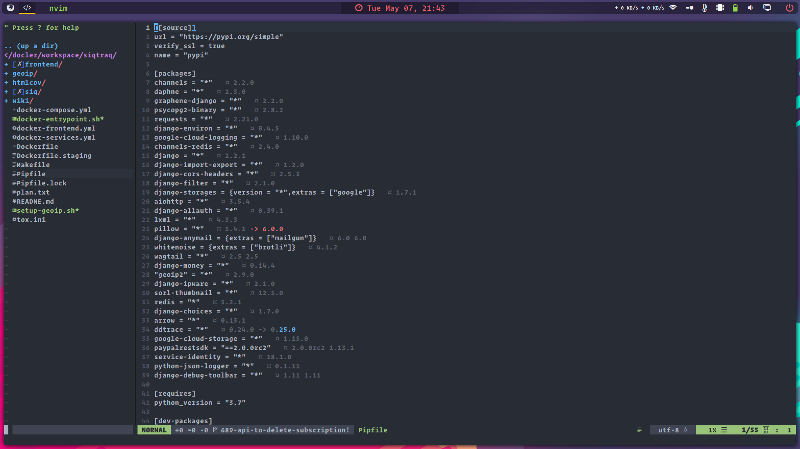
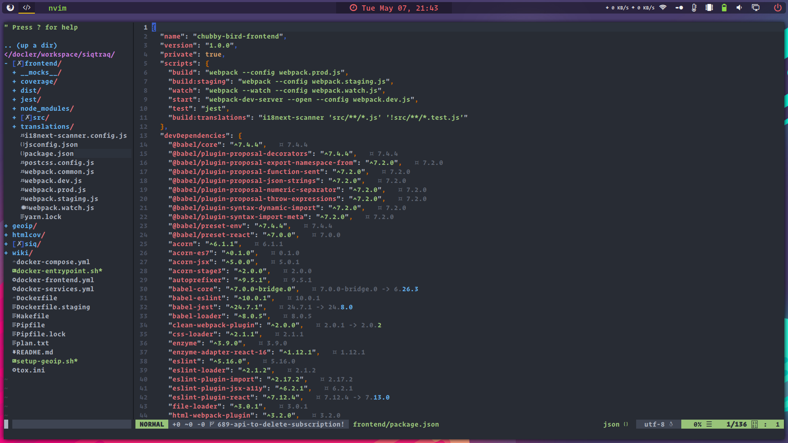

# Neovim dependency check





The concept is copied from [vim-package-info](https://github.com/meain/vim-package-info) (thank you),
but since that package wasn't working on my setup, and I really don't like debugging javascript
on my free time, I rewrote it in Rust as an exercise.

Also a thank you goes to @srishanbhattarai and the repo [neovim-calculator](https://github.com/srishanbhattarai/neovim-calculator)
for giving me the idea and the basics of how to write a neovim plugin in Rust.

This plugin should help keep track of projects' requirements, currently installed versions and latest available versions, giving
a quick feedback if any dependency needs to be updated and how painful it will be (based on semantic versioning).

## How does it work
Whenever you open a supported file (`cargo.toml`, `Pipfile` and `package.json` at the moment), the plugin will first
look for a lockfile (only works with `yarn.lock` for js right now), then print the currently installed version after the
dependency line in the manifest file.

After that it will query the registry to retrieve the latest available version, and if there is a more recent one
it will print and hihglight it next to the current one.

## Installation
Since I want to finish a couple of things before studying how to make a repo installable by neovim package managers, the process is manual right now.

Assumptions:
- `~/.local/bin/` should exist and be in `$PATH`
- `~/.config/nvim/plugin/` also should exist (and `~/.config/nvim` should be the neovim config directory

**Read the script before running it!**

```
git clone github.com/psykopear/neovim-package-info
cd neovim-package-info
./install.sh
```

## TODO
- [ ] Cache results for a while
- [ ] Check requirement and highlight if currently installed package does not match

## Notes
Don't misunderstand me, I hate JS, but also its community
